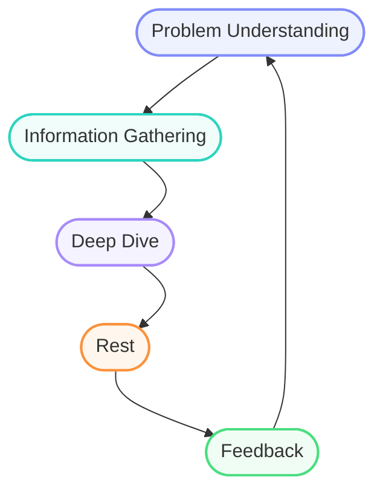

## Introduction

Product development is not about reaching a single, well-defined peak in one go; it’s more like traversing a mountain range—full of peaks, valleys, and paths with different characteristics, each requiring its own strategy, focus, and level of preparedness.

To move through this journey, you need the mindset of an endurance climber. It’s a long path, filled with trial and error, along with moments of progress, doubt, and even frustration.

In this piece, I’ll share my experience from the journey of building a technology product, along with some of the lessons I’ve learned along the way.

## Mapping the Mountain Range

If you’re familiar with classic computer science algorithms, you’ve probably heard of Divide & Conquer. In the context of building a technology product, this approach can be a very effective way of thinking.

Technology products usually come with many different technical challenges, and naturally, you can’t solve all of them at once.

This is where you need to map your mountain range. Start by identifying the different challenges involved in building your product, then break them down into smaller, manageable parts. In a way, you’re the one designing this mountain range.

Each challenge is like a peak in that range — and reaching it requires planning, the right tools, and time. In the following, I’ll introduce a cycle that helps you tackle each of these challenges — much like climbing each peak through its own path.

## Challenge-Solving Cycle

#### Understanding the Problem

This is the most important and decisive part of any challenge. If you truly understand the problem in front of you, a large part of the solution path is already behind you. This clarity helps you avoid going in the wrong direction, wasting time and energy, or ending up with superficial or incorrect solutions.

In many cases, the problem itself contains clues to its own solution — if you look at it closely enough.

From a technical perspective, this step helps prevent over-engineering. When you clearly understand what needs to be solved, you’re less likely to build heavy, inefficient, or unnecessarily future-proof solutions, and more likely to design something that is simple, effective, and fit for purpose.

#### Gathering Information

Once you have a clear understanding of the problem, the next step is to gather relevant data and information. This stage is like preparing your gear before climbing a peak. The right information feeds your thinking and helps you form a clearer picture of the solution.

This information can come from different sources:

- Reading official documentation and technical articles
- Searching online and learning from others' experiences
- Using tools like ChatGPT for brainstorming or summarizing ideas
- Exploring open-source code or similar projects

Sometimes, at this stage, you realize that your problem has already been solved by someone else—or at least that the path to solving it is well understood. This can act as a shortcut, saving you a significant amount of time and effort.

#### Going Deep

At this stage, it’s time to fully focus on solving the problem. The data you’ve gathered so far is like pieces of a puzzle — now you need to put them together through deep thinking and concentration to form a complete picture.

To reach a real solution, you need to immerse yourself in the problem. Your mind should be clear, focused, and free from distractions. Everyone has their own way of concentrating, but some common techniques include:

- Stepping away from social media and turning off notifications
- Writing things down on paper or a whiteboard to organize your thoughts
- Going for a walk and thinking in silence

This might be the hardest part of the process, because you have to move beyond the surface and go deeper — like descending into a valley within the mountains to find a path upward. But it’s often in these depths that simple, creative, and effective ideas emerge.

#### Rest

Now we’ve reached one of the most interesting parts of the cycle. After deeply engaging your mind with the problem, it’s time to step back and give it some space to breathe.

This might sound familiar: you spend hours struggling with a problem and get nowhere, but then suddenly — after a cup of coffee or a short walk — the solution just clicks.

Why does this happen?

When your mind steps away from direct effort, your subconscious starts reorganizing and connecting the information in the background. And if you’ve truly immersed yourself in the problem in the previous stage, your mind keeps working on it — even when you think you’re resting.

What’s fascinating is that solutions often appear at the most unexpected moments: while driving, in the shower, during a walk, or even while having your coffee. Your mind can suddenly surprise you.

#### Feedback Sessions

After all the thinking, designing, and effort you’ve put into solving the problem, it’s time to share your work with others. This can be done through regular sessions with your teammates. One interesting thing is that when you start explaining a problem and your solution to others, you often discover new insights yourself — as if explaining is a form of thinking all over again.

In addition, getting feedback from teammates can give you fresh perspectives. Someone might spot a weakness you missed or suggest a simpler approach to the solution. Feedback sessions should be open and honest. Don’t be afraid of having your ideas challenged — this is a natural and essential part of refining and improving your solution.

If your team follows Scrum, you can briefly share what you’ve been working on during daily stand-ups. This helps get others mentally involved, gives them context, and might spark ideas or insights that become useful later in feedback sessions. In the end, this leads to better collaboration and more effective discussions.

## The End of One Cycle, the Beginning of the Next

This cycle can repeat as many times as necessary until you arrive at a solution that is good enough to move forward. Once that happens, you step out of the cycle and into the implementation phase.

And this is the moment to congratulate yourself—you've reached the first peak in your product's mountain range.

But the journey is far from over. More peaks are waiting ahead, each with its own challenges and characteristics. Now that you've gained the tools, experience, and confidence from climbing the first one, you're better prepared to tackle the next.

## Practical Takeaways

A great product is the result of teamwork. Throughout the product development journey, you'll collaborate with people in different roles—product designers, product managers, backend and frontend engineers, and many others. Each role comes with its own priorities, perspective, and way of thinking. The better you understand these perspectives, the easier it becomes to communicate effectively and work as a cohesive team.

Solving technical challenges is only one part of building a successful product. To be effective, you'll also need to develop skills beyond engineering, such as meeting deadlines, aligning your teammates, communicating with stakeholders and managers, managing resources, and writing good documentation. These skills are just as important as technical expertise and will make you a more effective engineer.

When it comes to mapping your mountain range, things won't always be clear. Sometimes the landscape is so foggy that you can't fully understand the problem or break it down into smaller challenges. You may only know what kind of product you want to build, while the actual user needs are still unclear—even to you and your product manager.

When that happens, forget about mapping the mountain range for a while and just start moving. Jump into the challenge-solving cycle and begin exploring. As the problem becomes clearer, you'll naturally be able to map the mountain range more accurately.

Always remember: your primary mission is to keep moving forward. Never get stuck in any single stage of the journey.

## Final Thoughts

Building a technology product is often accompanied by challenges, complexity, and sometimes a fair amount of pressure. What matters most throughout this journey is resilience—the ability to navigate obstacles thoughtfully instead of being discouraged by them.

The road is rarely smooth, but if you approach it with a mindset of continuous learning and collaboration, even the toughest moments become valuable experiences. Enjoy the journey with your teammates instead of focusing only on the destination.

I hope this article has been useful and that it provides ideas or guidance for your own product development journey.

Happy building!

